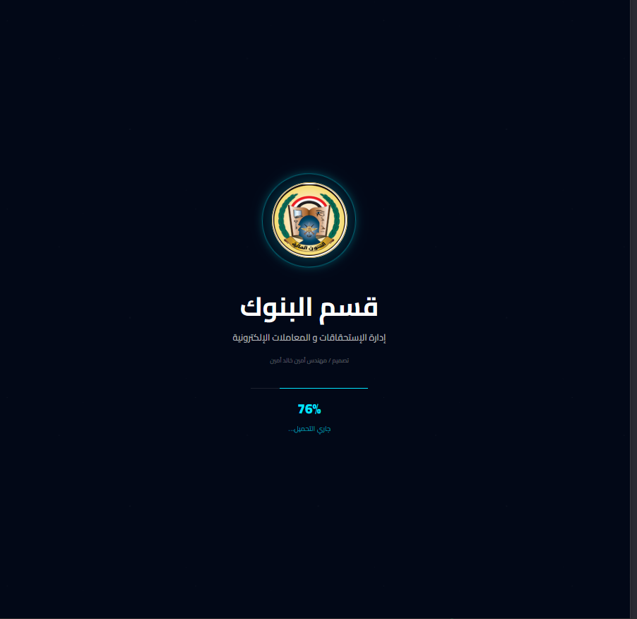

# HK System



نظام محلي لإدارة المرتدات، متابعة السداد، ونقل السجلات إلى الأضابير بطريقة آمنة بدون حذف نهائي للبيانات.

## التشغيل المحلي فقط

المشروع يعمل بقاعدة SQLite فقط ولا يعتمد على PostgreSQL أو Neon DB أو أي قاعدة بيانات سحابية. يمكن وضع ملف قاعدة البيانات على نفس الجهاز أو على مسار شبكة محلي LAN مشترك بين المستخدمين.

## الوحدات الرئيسية

- 📊 مرتدات الحوافز: عرض، فلترة، تعديل، تصدير، وأرشفة سجلات مرتدات الحوافز.
- 💰 مرتدات المرتبات: عرض، فلترة، تعديل، تصدير، وأرشفة سجلات مرتدات المرتبات بشكل مستقل عن الحوافز.
- 💸 السداد الذكي: مطابقة سجلات المرتدات مع بيانات السداد/التسوية ومتابعة حالات التسوية.
- الأضابير: حفظ دفعات الأرشفة، عرض التفاصيل، ومنطق الاسترجاع الآمن عند الحاجة.

## المتطلبات

- .NET 8 SDK
- Node.js للتحقق من ملفات JavaScript

## أوامر الفحص والتشغيل

```powershell
node --check wwwroot/js/app.js
dotnet build HKServer.csproj
dotnet run --project HKServer.csproj --urls http://0.0.0.0:5001
```

بعد التشغيل افتح:

```text
http://localhost:5001

Startup URL: use `http://localhost:5001` for local access. Do not use `http://localhost:5000` for this app.
```

## قاعدة البيانات والتخزين

- قاعدة البيانات: SQLite عبر `Microsoft.Data.Sqlite`.
- ملف قاعدة البيانات الافتراضي عند عدم ضبط إعداد خاص: `hk.db` بجانب ملفات تشغيل التطبيق.
- يمكن ضبط مسار قاعدة البيانات من `appsettings.json` باستخدام المفتاح `LocalDatabasePath`.
- مثال لمسار ملف على مشاركة LAN:

```json
{
  "LocalDatabasePath": "\\\\128.30.200.225\\esth_share\\فرع الاعمال الحسابية\\قسم البنوك\\منظومة الجديدة\\hk.db"
}
```

- يجب أن يكون ملف قاعدة البيانات موجودا في المسار المحدد قبل تشغيل النظام.
- إذا كان المسار المحدد غير متاح أو لا يملك المستخدم صلاحيات قراءة/كتابة/إنشاء، يفشل التشغيل برسالة واضحة ولا يتم الرجوع تلقائيا إلى قاعدة أخرى.
- كل المستخدمين الذين سيشغلون النظام على نفس قاعدة البيانات يجب أن يملكوا صلاحية الوصول إلى نفس مجلد المشاركة.
- لا توجد آلية تبديل تلقائي إلى قاعدة بيانات سحابية.
- لا يجب رفع ملفات قاعدة البيانات أو ملفات SQLite المؤقتة إلى GitHub لأنها قد تحتوي على بيانات تشغيل فعلية.

## ملاحظات الأرشفة والسداد الذكي

- الأرشفة إلى الأضابير تعمل كـ MOVE آمن: لا يتم الحذف النهائي، بل يتم تعليم السجلات المؤرشفة مثل `IsArchived` وربطها بدفعة أرشفة.
- يتم الحفاظ على `RawData` والمعرّفات الأصلية حتى يمكن عرض التفاصيل أو الاسترجاع لاحقا.
- السداد الذكي يستبعد السجلات المؤرشفة من المطابقة ويتعامل مع الشهر كنص مثل `12-2025`.
- السداد الذكي يستخدم قاعدة SQLite المحلية فقط.
- تشغيل SQLite عبر مشاركة LAN ممكن، لكنه قد يواجه حدودا في القفل والتزامن عند كثرة المستخدمين أو العمليات المتزامنة. يفضل اختبار الأداء والنسخ الاحتياطي الدوري للملف.

## ملاحظات أمنية

- لا ترفع ملفات مثل `hk.db` أو ملفات عينات تحتوي على بيانات حقيقية.
- لا ترفع ملفات إعدادات تحتوي على كلمات مرور أو مفاتيح API أو مسارات داخلية خاصة.
- `server_config.json` ملف إعداد محلي ويجب أن يبقى خارج المستودع.

## تحذيرات معروفة

- لا توجد حاليا تبعية قاعدة بيانات سحابية في المشروع.
- إذا ظهرت ملفات إعداد محلية قديمة تخص قواعد بيانات خارجية فهي بقايا بيئة محلية ويجب عدم رفعها.
