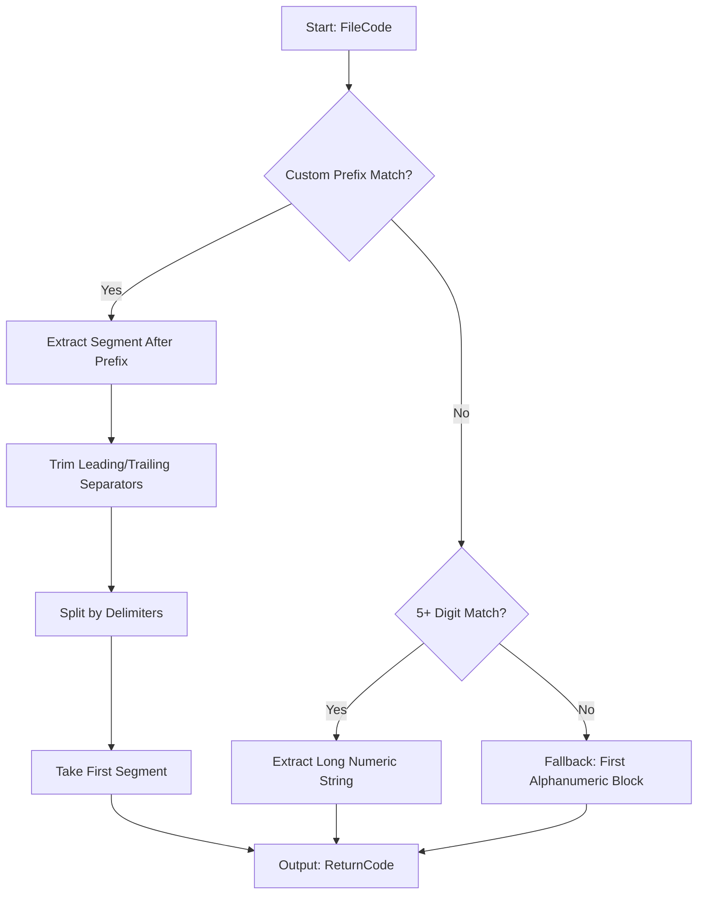

# Data Model: Custom Prefix Extraction Flow

## Concept: Extraction Logic
The system uses a non-destructive view-layer extraction model. This means the original `FileCode` remains untouched while the `ReturnCode` is derived on-the-fly for display and filtering.

## Extraction Flow (Step-by-Step)

## Entity Details

### Extraction Settings
- **Prefix List**: Array of strings (from `extraction_prefixes` in IndexedDB).
- **Separators**: Fixed set `[- . _]` and space.

### Return Data Row
- **FileCode**: Raw string from DB.
- **ReturnCode**: Derived property created during table render.
- **IsExtracted**: Boolean flag (internal) to track if logic succeeded.

## Validation Rules
- **Prefix Consistency**: Prefixes cannot be empty.
- **Separator Handling**: Must handle multiple consecutive separators (e.g., `Army--463`).
- **Data Type**: `ReturnCode` is always treated as a string for display but can be parsed numerically for filtering.
